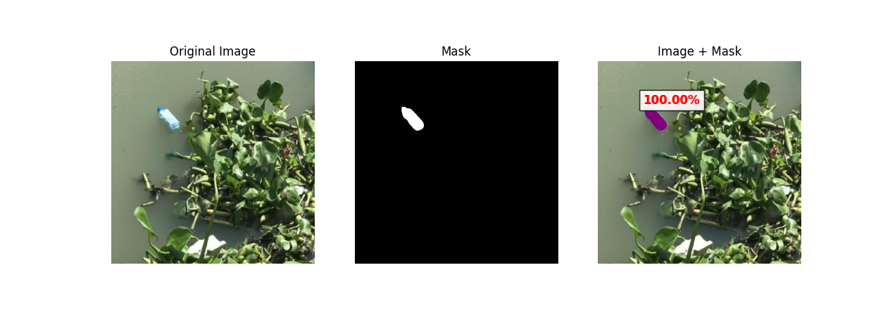

# Sea Trash Detection and Segmentation

This project was developed as part of the **Computer Vision** course at President University. It combines **YOLOv8** for object detection and **Mask R-CNN** for instance segmentation to analyze images of marine debris. The system identifies and localizes trash objects, segments their contours, and calculates how much of each detected object is covered by a segmentation mask.

---

## 👨‍🏫 Project Information

**Course**: Computer Vision  
**Institution**: President University  
**Semester**: 5
**Year**: 2025  

**Group Members**:
- Ragil Maulana Ilyasha (001202300117)  
- Davina Ritzky Amarina (001202300039)  
- Emilia Adinda Putri Ginting (001202300155)  
- Nava Windah Simanjuntak (001202300154)  

---

## 🗂 Repository Contents

This GitHub repository only contains the main script:

```

.
├── 1ocean\_waste\_setup.py

```

Other required files such as the dataset and model weights are available via Google Drive and Roboflow (see below).

---

## 📦 Required Files

To run this project, the following external files are required:

### 🔗 Download Links

- **Google Drive** (model & dataset archive):  
  [https://drive.google.com/drive/folders/1AuhAFc9xcNfwwSpLCR4lAP7_jw7agHFe?usp=sharing](https://drive.google.com/drive/folders/1AuhAFc9xcNfwwSpLCR4lAP7_jw7agHFe?usp=sharing)

- **Dataset via Roboflow** (alternative access):  
  [https://universe.roboflow.com/roboflow-6dmu5/sea_trash_2](https://universe.roboflow.com/roboflow-6dmu5/sea_trash_2)

### 📁 Folder Setup

After downloading:
1. Place `best13.pt` in the same directory as the Python script.
2. Extract the dataset so that this structure exists:

```

sea\_trash\_train\_2.v7i.yolov8/
└── train/
└── images/

````

---

## ⚙️ Installation

Make sure Python 3.8+ is installed. Then, install the required Python packages:

```bash
pip install torch torchvision ultralytics matplotlib opencv-python pillow
````

---

## ▶️ How to Run

To run the script:

```bash
python 1ocean_waste_setup.py
```

The script will:

* Randomly select one image from the dataset
* Detect objects using YOLOv8
* Segment objects using Mask R-CNN
* Display three visual outputs:

  * The original image
  * The binary segmentation mask
  * An overlay showing detections, segmentation, and coverage percentage

---

## 🖼️ Example Output

Below is an example of the final visual output, showing the combined detection and segmentation process:



---

## ℹ️ Additional Notes

* This project is intended for educational purposes.
* The provided script can be used as a reference or modified to work with other object detection and segmentation models.
* Feel free to experiment with other datasets, models, or evaluation metrics based on your needs.

---

## 📄 License

This project is licensed under the **MIT License**. You are free to use, modify, and distribute the contents with proper attribution.
